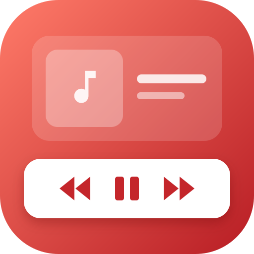
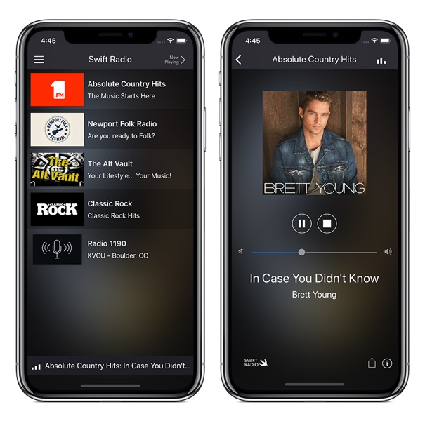

<p align="center">
  
</p>

<h1 align="center">FRadioPlayer</h1>

<p align="center">
  <a href="https://github.com/fethica/FRadioPlayer/actions/workflows/spm.yml"></a>
  <a href="https://github.com/fethica/FRadioPlayer/actions/workflows/demo.yml"></a>
  <a href="https://github.com/fethica/FRadioPlayer/releases/latest"></a>
  <a href="https://swiftpackageindex.com/fethica/FRadioPlayer"></a>
  <a href="LICENSE"></a>
</p>

FRadioPlayer is a wrapper around AVPlayer to handle internet radio playback.

## Example

SwiftUI demo source lives under `Example/FRadioPlayerDemo/`.

Use XcodeGen to generate and open the demo project:

```sh
brew install xcodegen    # once
cd Example
xcodegen                 # generates FRadioPlayerDemo.xcodeproj
open FRadioPlayerDemo.xcodeproj
```

## Features
- [x] Support internet radio URL playback
- [x] Update and parse track metadata
- [x] Update and show album artwork (via iTunes API)
- [x] Automatic handling of interruptions
- [x] Automatic handling of route changes
- [x] Support bluetooth playback
- [x] Network interruptions handling
- [x] Automatic stall recovery with bounded retries (reload with backoff, clean error state when the stream is gone)
- [x] Support for Swift Package Manager SPM

## Requirements
- iOS 14.0+
- macOS 11.0+
- tvOS 14.0+
- Xcode 16+ (Swift 6 toolchain; the package builds in Swift 6 language mode, your app can stay in Swift 5 mode)

## Installation

### Swift Package Manager

FRadioPlayer is available through [SPM](https://github.com/apple/swift-package-manager). To add it in Xcode: File > Add Packages… and use the URL of this repository. Or add the dependency in `Package.swift`:

```swift
.package(url: "https://github.com/fethica/FRadioPlayer.git", from: "0.4.0")
```

## Quick Start

Add the package, then use the shared player and observe changes.

```swift
import FRadioPlayer

// Adopting FRadioPlayerObserver here makes the class main-actor isolated
final class RadioController: NSObject, FRadioPlayerObserver {
    let player = FRadioPlayer.shared

    override init() {
        super.init()
        player.addObserver(self)
        player.enableArtwork = true      // Optional (default true)
        player.isAutoPlay = true         // Optional (default true)
        player.radioURL = URL(string: "https://your.station/stream.mp3")
        // Or manually control playback: player.play()
    }

    func radioPlayer(_ player: FRadioPlayer, playerStateDidChange state: FRadioPlayer.State) {
        print("Player state: \(state)")
    }
}

// From a nonisolated context, hop to the main actor
Task { @MainActor in
    FRadioPlayer.shared.togglePlaying()   // Play/Pause
    FRadioPlayer.shared.stop()            // Stop
    FRadioPlayer.shared.volume = 0.8      // Set volume (0.0...1.0)
}
```

### Manual

Prefer SPM. If needed, drag `Sources/FRadioPlayer` into your Xcode project.

## Concurrency

Since 0.4.0 `FRadioPlayer` is bound to the main actor and the package builds in Swift 6 language mode.

- Call the player from the main actor. From a background context, hop first: `Task { @MainActor in FRadioPlayer.shared.play() }`.
- Observer callbacks arrive on the main actor. A class that adopts `FRadioPlayerObserver` in its declaration is inferred `@MainActor`. A conformance added in an extension keeps the type's own isolation and still compiles.
- A controller that calls the player from its own methods must be main-actor isolated. Add `@MainActor` to the class, as the demo's `RadioPlayer` does. This applies in Swift 5 mode too: calling an isolated method from a nonisolated one is an error, not a warning.
- `FRadioPlayer.State` and `FRadioPlayer.PlaybackState` are `Sendable`. `FRadioPlayer.Metadata` is not, because it carries `AVTimedMetadataGroup` values; keep it on the main actor.
- Custom `FRadioArtworkAPI` providers receive a `@Sendable` completion and may call it from any queue. Existing providers written with a plain completion keep compiling.
- AVFoundation and audio session callbacks that can arrive off the main thread are received `nonisolated` inside the library and hopped explicitly. Nothing is marked `@unchecked Sendable` or `nonisolated(unsafe)`.

See the [0.4.0 release notes and migration guide](.github/release-notes/0.4.0.md) when upgrading from 0.3.x.

## Audio session

On iOS and tvOS the player sets the shared `AVAudioSession` category to `.playback`, with the default mode and no category options, when `FRadioPlayer.shared` is first accessed. The playback category supports AirPlay and Bluetooth A2DP without additional options on iOS.

An app that owns its audio session opts out before its first access to `shared`, for example in its `App` initializer or `application(_:didFinishLaunchingWithOptions:)`:

```swift
FRadioPlayer.configuresAudioSession = false
```

Setting it after `shared` exists has no effect. The player never activates or deactivates the session.

## Usage

### Basics

1. Import `FRadioPlayer`

```swift
import FRadioPlayer
```

2. Get the singleton `FRadioPlayer` instance

```swift
let player = FRadioPlayer.shared
```

3. Observe player events (optional)

```swift
final class MyObserver: NSObject, FRadioPlayerObserver {
    override init() {
        super.init()
        FRadioPlayer.shared.addObserver(self)
    }

    func radioPlayer(_ player: FRadioPlayer, playerStateDidChange state: FRadioPlayer.State) {
        // handle state change
    }
}
```

4. Set the radio URL
```swift
player.radioURL = URL(string: "http://example.com/station.mp3")
```

### Properties

- `isAutoPlay: Bool` Auto-play when `radioURL` is set (default `true`).
- `enableArtwork: Bool` Fetch album artwork via iTunes API (default `true`).
- `artworkAPI: FRadioArtworkAPI` Artwork provider, default `iTunesAPI(artworkSize: 300)`.
- `rate: Float?` Current `AVPlayer` rate.
- `isPlaying: Bool` Convenience read-only state.
- `state: FRadioPlayer.State` Player state.
- `playbackState: FRadioPlayer.PlaybackState` Playback state.
- `volume: Float?` Player volume, 0.0…1.0.
- `httpHeaderFields: [String:String]?` HTTP headers for the underlying `AVURLAsset`.
- `metadataExtractor: FRadioMetadataExtractor` Strategy to parse timed metadata.
- `currentMetadata: FRadioPlayer.Metadata?` Last parsed timed metadata.
- `currentArtworkURL: URL?` Last resolved artwork URL.
- `duration: TimeInterval` Total duration, 0 for live streams.
- `currentTime: Double` Current playback time in seconds.
- `FRadioPlayer.configuresAudioSession: Bool` (static) Whether the player sets the audio session category, default `true`. See [Audio session](#audio-session).

### Playback controls

- Play
```swift
player.play()
```

- Pause
```swift
player.pause()
```

- Stop
```swift
player.stop()
```

- Toggle playing state
```swift
player.togglePlaying()
```

- Seek (files with a known duration)
```swift
player.seek(to: 30) {
    // Called exactly once, on the main actor
}
```

The completion is always called exactly once, on the main actor, after `seek` returns. That includes a live stream or an item whose duration isn't known yet (no seek happens), no loaded item, and a seek that is superseded by a newer one. Seeking keeps the playback intent: a playing player keeps playing, a paused or stopped player stays that way, and a pause issued while the seek is in flight wins.

For live streams, `pause()` keeps the item and its connection, and resumes from the buffered position. `stop()` drops the connection and clears metadata and artwork; the next `play()` reconnects.

### Observer methods

- Player state
```swift
func radioPlayer(_ player: FRadioPlayer, playerStateDidChange state: FRadioPlayer.State)
```

- Playback state
```swift
func radioPlayer(_ player: FRadioPlayer, playbackStateDidChange state: FRadioPlayer.PlaybackState)
```

- Item change
```swift
func radioPlayer(_ player: FRadioPlayer, itemDidChange url: URL?)
```

- Timed metadata
```swift
func radioPlayer(_ player: FRadioPlayer, metadataDidChange metadata: FRadioPlayer.Metadata?)
```

- Artwork URL
```swift
func radioPlayer(_ player: FRadioPlayer, artworkDidChange artworkURL: URL?)
```

- Duration and time updates
```swift
func radioPlayer(_ player: FRadioPlayer, durationDidChange duration: TimeInterval)
func radioPlayer(_ player: FRadioPlayer, playTimeDidChange currentTime: TimeInterval, duration: TimeInterval)
```

## Swift Radio App

For more complete app features, check out [Swift Radio App](https://github.com/analogcode/Swift-Radio-Pro) based on **FRadioPlayer**

<p align="center">
    
</p>

## Development

This repository uses Swift Package Manager for building and testing:

```sh
swift build
swift test
```

The test suite covers the public API contract, metadata extraction, the artwork API (stubbed, no network), playback against bundled fixtures, and state machine regressions. CI runs it on macOS and on an iOS simulator for pull requests, pushes to `main` and tags. Bug fixes should come with a failing test first.

## Author

[Fethi El Hassasna](https://twitter.com/fethica)

## License

FRadioPlayer is available under the MIT license. See the LICENSE file for more info.
